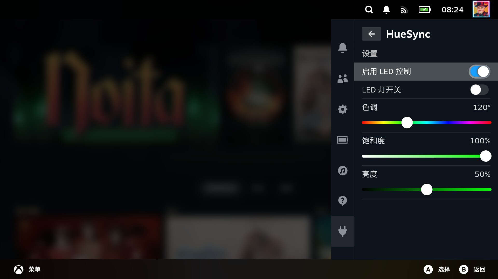

English | [简体中文](./README_cn.md)
# HueSync
[](https://gitHub.com/alarifgit/HueSync/releases) [](https://github.com/alarifgit/HueSync/releases/latest) [](https://github.com/alarifgit/HueSync/releases/latest)

Plugin for [decky-loader](https://github.com/SteamDeckHomebrew/decky-loader)

LED controller for handheld devices

|                           |
| ------------------------- |
|  |

## Supported Devices
### Directly Supported
- AYANEO
  - AIR/Pro/1S
  - 2/2S
  - GEEK/1S
- GPD
  - Win 4 (Support by [pyWinControls](https://github.com/pelrun/pyWinControls))
- OneXPlayer
  - OneXFly
  - X1
- Aokzoe
  - A1
  - A2
- ROG
  - Ally

### Additional Support
Support for more Ayaneo devices through [ayaneo-platform](https://github.com/ShadowBlip/ayaneo-platform), can be obtained by installing the dkms module through [AUR](https://aur.archlinux.org/packages/ayaneo-platform-dkms-git). The latest ChimeraOS comes with it.

- AYANEO
  - AIR/Pro/1S
  - 2/2S
  - GEEK/1S
  - AIR Plus
  - SLIDE

Similarly, Support for Ayn devices through [ayn-platform](https://github.com/ShadowBlip/ayn-platform),  [AUR](https://aur.archlinux.org/packages/ayn-platform-dkms-git)
- AYN
  - Loki Max

## One-step Installation
```
curl -L https://raw.githubusercontent.com/alarifgit/huesync/main/install.sh | sh
```
